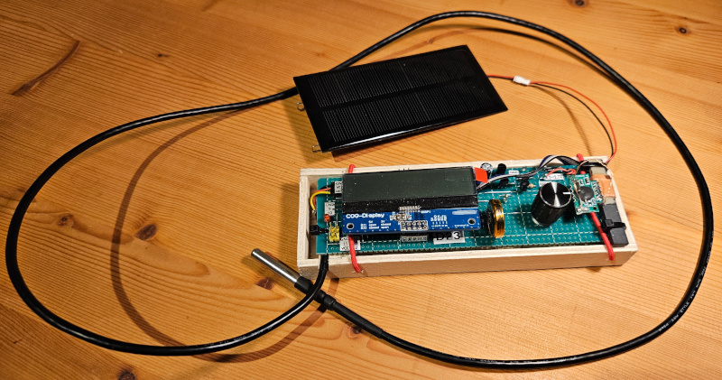
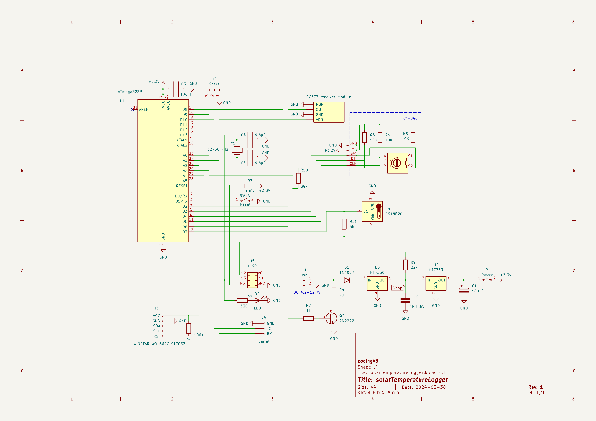
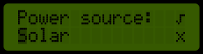

# solarTemperatureLogger
The device is a logger for temperature and time (DCF77 time signal driven). It is powered by a small solar panel (Battery or USB powerbank would also work).
- A dataset consists of a temperature value and the corresponding timestamp 
- Datasets can be created manually with a knob or automatically by schedule
- Up to 167 datasets can be store in a persistent buffer (1kB-EEPROM)
- Datasets from the persistent buffer can be sent via serial to a computer



## License and copyright
My code is licensed under the terms of the 2-Clause BSD License [Copyright (c) 2024 codingABI](LICENSE). 

### External code
I use external code in this project in form of libraries and two small
code piece called summertime_EU and getBandgap, but does not provide these code. 

If you want to compile my project, you should be able to download the needed libraries

- DCF77 (by Thijs Elenbaas)
- Time (by Michael Margolis/Paul Stoffregen)
- DallasTemperature (by Miles Burton)

with the Arduino IDE Library Manager and the libraries

- SWITCHBUTTON (https://github.com/codingABI/SWITCHBUTTON by codingABI)
- KY040 (https://github.com/codingABI/KY040 by codingABI)
- arduino_ST7032 (https://github.com/tomozh/arduino_ST7032 by tomozh@gmail.com)

from GitHub.

For details to get the small code pieces for

- summertime_EU "European Daylight Savings Time calculation by "jurs" for German Arduino Forum"
- getBandgap by "Coding Badly" and "Retrolefty" from the Arduino forum

see [externalCode.ino](DCF77voiceClock/externalCode.ino).

## Hardware
- Microcontroller ATmega328P (In 8 MHz-RC mode. Board manager: "ATmega328 on a breadboard (8 MHz internal clock)" )
- 32768 kHz clock crystal for timer2
- DCF-3850M-800 DCF77 time signal receiver
- WINSTAR WO1602G ST7032 LCD I2C display
- DS18B20 temperature sensor
- KY-040 rotary encoder
- 6V/150mA solar panel
- 1F/5.5V supercap
- HT7333A 3.3V voltage regulator
- HT7350A 5.0V voltage regulator (Voltage protection for supercap)
- 1N4007 diode to prevent current from supercap back to Vin
- 2n2222-Transistor to trigger load, when powered by an USB powerbank

Perfboard with disconnected LCD display (when connected the display covers the ATmega328P)


## Used development environment 
Arduino IDE 1.8.19 (Without "real portable" support version 2.* makes no sense for me https://forum.arduino.cc/t/arduino-ide-2-0-portable/)
Arduino AVR Boards Version 1.8.6

# Appendix

## Schematic



## User interface
- By default the display is disabled to save energy
- If the display is enabled several data dashboards are available
  - [Dashboard1 Latest](#dashboard1-latest)
  - [Dashboard2 Minimum](#dashboard2-minimum)
  - [Dashboard3 Maximum](#dashboard2-maximum)
  - [Dashboard4 Power](#dashboard3-power)
  - [Dashboard5 Time](#dashboard4-time)
  - [Dashboard6 First and next time synchronization](#dashboard6-first-and-next-time-synchronisation)
  - [Dashboard7 Latest recording](#dashboard6-latest-recording)
  - [Dashboard8 Time/Date...](#dashboard8-timedate)
  - [Dashboard9 Time sync...](#dashboard9-time-sync)
  - [Dashboard10 View buffer...](#dashboard10-view-buffer)
  - [Dashboard11 Send buffer...](#dashboard11-send-buffer)
  - [Dashboard12 Reset buffer...](#dashboard12-reset-buffer)
  - [Dashboard13 Power source...](#dashboard13-power-source)
  - [Dashboard14 Record mode...](#dashboard14-record-mode)
- Pressing the knob toggles between the [Dashboard1 Latest](#dashboard1-latest) and disabling the display
- Rotating the knob scrolls through the different dashboards. After the last dashboard the display will be disabled
- Long pressing the knob stores a valid dataset to the persistent buffer and displays the message "Stored" 
- After 60 seconds without pressing or rotating the knob the display will be disabled
- A scale in the second line on the left side shows the dashboard index
- When [Vcap](#vcap) is below 3.35V the display stays disabled. Additionally the red status LED flashes, if the knob is pressed or rotated.

### Dashboards

#### Dashboard1 Latest


Shows the temperature and time of the latest dataset. Every second a new dataset will be requested from the temperature sensor, until this dashboard is displayed.

#### Dashboard2 Minimum


Shows the dataset with the lowest temperature. 

- Long pressing the knob resets the dataset 

#### Dashboard3 Maximum


Shows the dataset with the highest temperature. 

- Long pressing the knob resets the dataset

#### Dashboard4 Power


| Line  | Description |
| ------------- | ------------- |
| 1 | Voltage [Vcap](#vcap) at the supercap and the calculated remaining runtime until the supercap is discharged (Units h=hours, m=minutes) below 2.86V. Below 2.86V the device will stops working. |
| 2 | Current device uptime (Units d=days, h=hours) |

This dashboard keeps the display permanently active, even if the knob is no longer rotated or pressed.

#### Dashboard5 Time


| Line  | Description |
| ------------- | ------------- |
| 1 | Current device local time. The antenna symbol right to the time is displayed, when the last DCF77 time synchronization was successful.  |
| 2 | Four chars for lastest device reset reason |

Reset reasons:
- W for Watchdog System Reset
- B for Brown-out Reset
- E for External Reset
- P for Power-on Reset

#### Dashboard6 First and next time synchronization


| Line  | Description |
| ------------- | ------------- |
| 1 | First successful time synchronization (or "Time missing" if initial DCF77 time sync or manual time set is still missing) |
| 2 | Time until the next scheduled time synchronization (Units h=hours, m=minutes) |

#### Dashboard7 Latest recording


| Line  | Description |
| ------------- | ------------- |
| 1 | Time and date of latest dataset stored in the persistent buffer (or "Empty buffer" when persistent buffer is empty) |
| 2 | Current/maximum dataset index in the persistent buffer |

#### Dashboard8 Time/Date...


Set the time and date manually. Pressing the knob will start the selection for the time and date.

##### Selection


- Rotating the knob selects "√", "X" or a time/date components. The selected item is marked by a blinking block cursor.
- Pressing the knob confirms the selection
- Confirming "X" (or after 60 seconds without pressing or rotating the knob) cancels the dialog and discards the changes.
- Confirming "√" commits the changes
- If a time/date component was selected and confirmed, its value can be changed in the editor

##### Editor


- Rotating the knob changes the value of the select time/date component. The selected component is marked by a lowered cursor.
- Pressing the knob (or no pressing or rotating the knob for 60 seconds) confirms the changed value and goes back to the selection.

#### Dashboard9 Time sync...


Starts a DCF77 time synchronization when pressing the knob


- Pressing the knob cancels the time synchronization and returns to the dashboard selection
- After 15 minutes without a successful synchronization the sync will be canceled
- The antenna symbol right on first line shows the receiving of valid DCF77 signals

#### Dashboard10 View buffer...


View all datasets stored in persistent buffer when pressing the knob


- Rotating the knob scrolls through the datasets
- Pressing the knob returns to the dashboard selection
- After 60 seconds without pressing or rotating the knob the dialog will be canceled

#### Dashboard11 Send buffer...


Sends all datasets from persistent buffer to serial (9600 baud) when pressing the knob in a csv-like format:

```
Begin
UTC time;Degree celsius
2024-04-26 15:00:00;21,5
2024-04-26 16:00.00;22,5
End
```

#### Dashboard12 Reset buffer...


Deletes all datasets from persistent buffer when pressing the knob

#### Dashboard13 Power source...


Pressing the knob will start the selection for the power source.

##### Selection


- Rotating the knob selects "√", "X" or changing the power source. The selected item is marked by a blinking block cursor.
- Pressing the knob confirms the selection
- Confirming "X" (or after 60 seconds without pressing or rotating the knob) cancels the dialog and discards the changes.
- Confirming "√" commits the changes
- If the power source was selected and confirmed, it can be changed in the editor

##### Editor


- Rotating the knob scrolls through the power sources. The selected item is marked by a lowered cursor.
- Pressing the knob (or no pressing or rotating the knob for 60 seconds) confirms the changed power source and goes back to the selection.

Power sources:
- Solar
- Battery
- USB powerbank

##### Solar
Use this mode if you are operating the device with a 6V solar panel. Automatically DCF77 time synchronizations will be startet, when Vcap >= 4.5V

##### Battery
Use this mode if you are operating the device with a 5-6V battery. Automatically DCF77 time synchronizations will be startet, when Vcap >= 4.2V

##### USB powerbank
Use this mode if you are operating the device with an USB powerbank. Most USB powerbanks will disconnect, if the power consumption is too low. To prevent this disconnection this mode creates every 30 seconds a load of 100mA for 1 seconds (but only when Vcap > 4.2V). Automatically DCF77 time synchronizations will be startet, when Vcap >= 4.2V

#### Dashboard14 Record mode...


Pressing the knob will start the selection for saving datasets manually or automatically in the persistent buffer. 

##### Selection


- Rotating the knob selects "√", "X" or changing the record mode. The selected item is marked by a blinking block cursor.
- Pressing the knob confirms the selection
- Confirming "X" (or after 60 seconds without pressing or rotating the knob) cancels the dialog and discards the changes.
- Confirming "√" commits the changes
- If the record mode was selected and confirmed, it can be changed in the editor

##### Editor


- Rotating the knob scrolls through the record modes. The selected item is marked by a lowered cursor.
- Pressing the knob (or no pressing or rotating the knob for 60 seconds) confirms the changed record mode and goes back to the selection.

Record modes:
- Manual
- Every hour
- 00:00:00
- 01:00:00
- ...
- 23:00:00

## Red status LED

| LED duration  | Description |
| ------------- | ------------- |
| 50ms | [Vcap](#vcap) is below 3.35V (too less for enabling the display) |
| 8s |  A Watchdog timeout expiration was detected and therefore a reset is pending |

## Clock/Timer2

Normally we would need a RTC module to build an electronic clock, but in this project the ATmega328P acts like a RTC. The ATmega328P works in 8 MHz-RC mode without the need of an external crystal. A 32768 kHz clock crystal is connected to the ATmega328P and is used to trigger timer2 once per second.  

With this schematic my ATmega328P drifts ~8s per day. This is OK for me, because the solarTemperatureLogger will start a DCF77 time synchronization once per day and resets the drift.

The solarTemperatureLogger uses internally UTC for time and date. On the display the time will be converted to german local time.

## Vcap

Vcap is the voltage at the supercap. It is an important base voltage for this device and determines whether microcontroller, temperature, sensor, display ... are disabled or enabled.  

## Automatically DCF77 time synchronzitation

A DCF77 time synchronzitation will be startet automatically:
- After a device reset
- Every 4 hours, until the first successful synchronzitation
- Every day at 14:00, after the first successful synchronzitation

If the time is set manually (see [Dashboard8 Time/Date...](#dashboard8-timedate)), this is equated to a successful first time synchronzitation.

The automatically DCF77 time synchronzitation will not be started, if [Vcap](#vcap) is too low:
- Vcap < 4.2V 
- or Vcap < 4.5V and device is set to power mode "Solar" (see [Dashboard13 Power source...](#dashboard13-power-source))

## Current consumption
The current and power consumption is not static and depends on how the device is used. Whenever possible the microcontroller goes to deep sleep.

| Szenario Nbr. | Szenario description | Average current consumption @3.3V |
| ------------- | ------------- | ------------- |
| 1 | Display is disabled, Temperature sensor is not used, DCF77 sync is not used | 19uA |
| 2 | [Dashboard1 Latest](#dashboard1-latest), Temperature sensor is used once per second, DCF77 sync is not used | 360uA |
| 3 | [Dashboard4 Power](#dashboard3-power), Temperature sensor is not used, DCF77 sync is not used | 113uA |
| 4 | Display is disabled, Temperature sensor is used once per hour, DCF77 sync is not used | 20uA |
| 5 | Display is disabled, Temperature sensor is used once per hour, DCF77 sync is used one time (duration 600s[=75% of timeout]) | 26uA |
| 6 | Display is disabled, Temperature sensor is used once per hour, DCF77 sync is used one time (duration 450s[=50% of timeout]) | 24uA |
| 7 | Display is disabled, Temperature sensor is not used, DCF77 sync is not used, power mode is set to "USB powerbank", Vcap > 4.2V | 105uA |

## Runtime without sun or at night

The solar panel charges the supercap during the day up to 5V. Without sun or in the night the device will be powered by the supercap and can run several hours, depending on the current consumption.

Discharge curves:


Important voltage levels for [Vcap](#vcap):
- Vcap >= 2.86V is needed to run the device
- Vcap >= 3.07V is needed for the temperature sensor
- Vcap >= 3.35V is needed for the display
- Vcap >= 4.5V* is needed for the automatic DCF77 time sync (*4.2V, when device is powered by battery or USB powerbank)

## Temperature measurement

When [Vcap](#vcap) is below ~3.07V the DS18B20 temperature sensor will not be used and manual/scheduled temperature recordings will be paused.